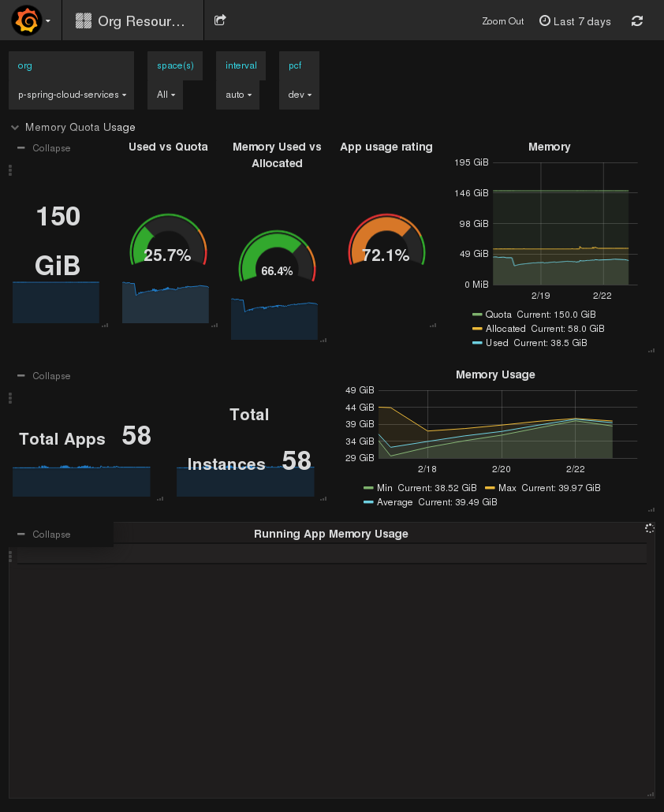

<!-- $theme: default -->

<!-- page_number: true -->
<!-- prerender: true -->
<!-- *page_number: false -->
<!-- *footer:  3/2017 -->


**Pivotal Cloud Foundry**

Charge Back strategies
===

<!-- Created by Luciano Silva ( [@lsilvapvt](https://github.com/lsilvapvt) ) -->


---

<!-- footer: PCF Charge Back strategies -->

# Typical PCF Charge Back strategies


1. Fixed Plans
2. Metered services (Pay-Per-Use)
3. Combination of Fixed + Metered

---


# 1. Fixed Plans

- Charge weekly/monthly/yearly per allocation model 
- Controlled by [PCF Quota Plans for Orgs and Spaces](https://docs.cloudfoundry.org/adminguide/quota-plans.html). Example:  


| Plan  | Total RAM | RAM per App | Routes  | Service Instances |  
|---|:---:|:---:|:---:|:---:|
| trial |        2G  | 1G  |   2   |      1  | 
| small |        10G  | 2G  |   50   |     10  |
| large |       100G  | 10G  | 1000   |    100  |  

  
- Easier to administer, automate and grow
- Consumers not forced to self police consumption costs
- Platform team required to monitor a bit  
_(Why do you want a 128 gig quota? Can we help?)_

---


# 2. Metered Services (Pay-Per-Use)

- Based on consumption of RAM, CPU, Services, etc
- Pay **after** use
- Must be able to charge customer frequently via a bill or report
- More difficult to implement from a process and automation standpoint
- Forces customers to self-police consumption in order to lower their costs


---


# 3. Combination of Fixed + Monitored
- Offer fixed plans and quotas for Application Instances 
- Charge for instances of select Services
- Fixed plan for AI's simplifies model, though complexity of monitoring automation of pay-per-use instances remains

---


# Usage Data Collection: Fixed plans

- Get list of all Orgs
    `cf curl /v2/organizations`  
    
- For each Org, get its corresponding quota details and pricing   
    `cf curl
    /v2/quota_definitions/<quota_guid>` 
- Define pricing structure for each plan, e.g.  
_trial: $X/month, small: $Y/month, large: $Z/month_
    
    
- Generate report/bill for charge back  of Orgs

---


# Usage Data Collection: Metered services
<div style="font-size: small;text-align: right;margin-top:-55px;margin-right:-20px; height:50px;">1/2</div>


- For each PCF Org/Space, for the week/month/year, get: 
  - Application Instances usage
     - RAM allocated
     - Disk allocated
     - Duration of instances (e.g. in seconds)  

  - Services Instances usage
     - Service Plan ID and info
     - Duration of instances (e.g. in seconds)  
    
---


# Usage Data Collection: Metered services
<div style="font-size: small;text-align: right;margin-top:-55px;margin-right:-20px; height:50px;">2/2</div>


- Define pricing structure for App usage, e.g. 
  - $X$ _dollars_ for _1 Gb RAM / hour_
  - $Y$ _dollars_ for _1 Gb of Disk / hour_

- Define pricing structure for each Service type and plan, e.g. 
  - RabitMQ `default` plan: $W$ _dolllars / hour_
  - RabitMQ `large` plan: $Z$ _dolllars / hour_

- Calculate and produce report/bill for each Org/Space, e.g.

$$OrgA_{usage} = ( X \cdot \sum_{GbRAM/hr}) +  (Y \cdot \sum_{GbDisk/hr}) + (\sum_{AllServices/hr}...)$$ 


---


# APIs and Tools for Usage Data Collection
  - [Cloud Foundry API - App Usage Events](https://docs.cloudfoundry.org/running/managing-cf/usage-events.html)
  - [App usage firehose nozzle](https://github.com/pivotalservices/app-usage-nozzle)
  - [Abacus](https://github.com/cloudfoundry-incubator/cf-abacus)
  - [***PCF Accounting Report API***](http://docs.pivotal.io/pivotalcf/1-8/opsguide/accounting-report.html#cf-cli)

---


# PCF Accounting Report API

- [Documentation](http://docs.pivotal.io/pivotalcf/1-10/opsguide/accounting-report.html#cf-cli)
- Collects applications and services usage information for each Org and persists it for 90 days (vs. 30 days from CF API events)
- Very usefull to collect granular usage data for _Metered Services_: API endpoints: `/app_usages` and `/service_usages` 
- Used by PCF Apps Manager - Accounting report
- Can be used to create custom Org and Space usage reports
- ---


# Example: Usage Report producer
<div style="font-size: small;text-align: right;margin-top:-55px;margin-right:-20px; height:50px;">1/2</div>

- [PCF Usage Report producer](https://github.com/pivotalservices/concourse-pcf-usage-report)
- Concourse CI pipeline that collects usage data for all Orgs 
- Uses the PCF Accounting Report API
- Consolidates a single JSON report containing App and Services usage information about all Orgs and Spaces
- JSON report can be fed into billing systems or dashboards  


 
---


# Example: Usage Report producer
<div style="font-size: small;text-align: right;margin-top:-55px;margin-right:-20px; height:50px;">2/2</div>

- [Sample JSON output report](https://github.com/pivotalservices/concourse-pcf-usage-report#json-schema-of-the-output-usage-report)
```
{
  "start_date": "YYYY-MM-DD",   // report start date
  "end_date": "YYYY-MM-DD",     // report end date
  "total_app_instance_count": integer,
  "total_app_memory_used_in_mb": integer,
  "total_disk_quota_in_mb": integer, ...
  "organizations": [    // array of organization objects
    {  // organization object
      "name": "string", ...
      "total_app_instance_count": integer,  
      "total_app_memory_used_in_mb": integer,
      "total_disk_quota_in_mb": integer, 
      "spaces": [  // array of all spaces of this org
        { // space object
          "name": "string",  ...
          "app_usages": [ // array of applications
            { // app usage object
              "guid": "string",...
```

---


# Example: Org Usage Grafana Dashboard


- Sample dashboard
- App usage data fed   
into a [TSDB](https://en.wikipedia.org/wiki/InfluxDB)
- Filters per org, space,  
interval and environment 

---


# Questions?

---


# Thanks!

